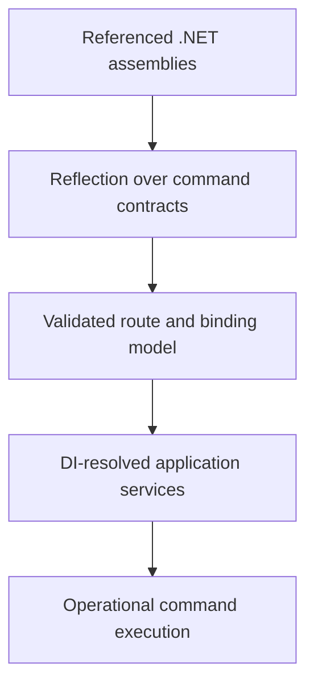

# Why Portico is reflection-first

> **Decision:** Portico deliberately uses reflection and does not support trimming or NativeAOT.
> This is the runtime model, not a temporary feature gap. If NativeAOT, minimal binary size or
> sub-millisecond startup is a requirement, choose an AOT-first framework.

Portico optimizes for a different kind of command-line application: an operational binary assembled
from a substantial .NET system. It may reference application services, domain types, cloud SDKs,
configuration, dependency injection, policy and several team-owned command-contract assemblies.

For that application, the managed runtime is not overhead surrounding the CLI. It is the platform
the CLI exists to use.

## Reflection is the composition mechanism

Portico reads ordinary .NET metadata:

- `[CliRoute]` methods become command routes;
- method parameters and `CliOptions` properties become bound inputs;
- derived option and argument attributes can supply domain-specific conversion;
- interface contracts can live in one assembly and be implemented in another;
- referenced contracts can be mounted beneath route prefixes;
- DI factories resolve only the handler reached by the invocation;
- help is rendered from the same discovered surface.

No generated command tree sits beside the application graph. The command surface is derived from
the types the application already compiled.

That model supports Portico's central proposition: **compile the operational CLI with the system it
operates**. See [Why Portico?](why-portico.md).

## What the choice buys

### Ordinary assembly composition

A team can publish a contract assembly using ordinary project or package references. A platform
binary references exact versions, mounts the contracts and lets the C# compiler check their type
relationships. There is no source-generator protocol or runtime plugin loader between the contract
and the composer.

### Domain-specific command vocabulary

Because attributes and `TypeConverter` are normal runtime extension points, an organization can
publish `[TargetEnvironment]`, `[ChangeTicket]` or `[ProductionApproval]` as reusable boundary
language. The same assembly can carry the domain value types and conversion policy those attributes
accept.

### Existing application runtime

The DI and Generic Host adapters reuse the service's configuration, logging, application lifetime
and container. A command can resolve the same application-layer service as another .NET host rather
than rebuilding its dependencies in a separate generated program.

### One behavioral implementation

Routing, binding and help have one reflection path. Supporting both reflection and generated paths
would require every behavior and bug fix to remain equivalent across two implementations. Portico
does not take on that permanent compatibility surface without evidence that its target users need it.

## What the choice costs

Reflection is not free:

- route discovery and materialization add managed-runtime startup work;
- the referenced assembly graph can produce a larger deployment;
- trimming may remove metadata and members Portico needs;
- `DispatchProxy` and runtime type discovery require dynamic code;
- configuration mistakes that an analyzer cannot see are rejected when
  `CliApplication.Create` builds the route table rather than by generated code;
- a globally distributed standalone tool must carry a .NET runtime or rely on one being installed.

Portico mitigates late failures with Roslyn analyzers, startup validation, typed contracts and
contract tests. Those checks make reflection bounded and observable; they do not turn it into AOT.

## Choose the optimization target deliberately

Portico is a good fit when the command:

- runs migrations, deployments, backfills or maintenance against a .NET system;
- reuses a large application or platform assembly graph;
- needs Generic Host, DI, configuration and cloud clients already present in that graph;
- is built and versioned with the solution it operates;
- performs work whose duration dominates process startup;
- benefits from team-owned contract assemblies compiled into one binary.

Prefer an AOT-first framework when the command:

- is invoked repeatedly in a tight shell loop;
- must be distributed as a tiny standalone executable;
- has a cold-start budget where managed-runtime startup is material;
- targets NativeAOT, trimming, mobile or constrained environments;
- does not benefit from linking the larger .NET application system.

[ConsoleAppFramework](https://github.com/Cysharp/ConsoleAppFramework) and
[CliFx](https://github.com/Tyrrrz/CliFx) are better fits when attributed or method-oriented CLI code
must also be source-generated and AOT-compatible. [The alternatives, honestly](alternatives.md)
keeps the dated comparison.

Portico should not compete with Go or Rust on their strongest CLI dimensions. Its advantage exists
where the full managed application system is more valuable than the smallest possible executable.

## Consumer-visible behavior

`CliApplication.Create`, every `Run`/`RunAsync` overload, `CliContractValidator<T>`, `CliTestHarness`
and `CliHostExtensions.RunPorticoAsync` carry `[RequiresUnreferencedCode]` and
`[RequiresDynamicCode]`.

A consumer using `PublishTrimmed=true` or `PublishAot=true` receives IL2026/IL3050 warnings at build
time. These annotations make the incompatibility visible; they do not make trimming safe.
Suppressing the warnings does not change the runtime requirements.

## Why not generate only the route table?

A partial generator sounds smaller than replacing the entire runtime, but it creates the same
semantic split. Route discovery, inherited attributes, option materialization, converters, help,
middleware options and assembly mounts would have to agree about which metadata is authoritative.
Generating only one layer moves the boundary rather than removing it.

That work may become justified, but it would be a product change rather than a transparent
optimization.

## Revisit conditions

Reopen the decision when evidence changes the target, for example:

1. Several users present concrete operational scenarios blocked specifically by AOT.
2. Portico is primarily distributed as a global standalone tool rather than built with a system.
3. Managed startup becomes material in measured target workloads.
4. A maintained generator design preserves derived attributes, assembly composition, middleware and
   runtime diagnostics without creating two divergent behavioral paths.
5. The .NET runtime gains a metadata-preservation mechanism that makes Portico's reflection model
   safe under trimming without a parallel implementation.

Until then, reflection is the simpler and more faithful implementation of Portico's purpose.

## Decision log

- **2026-07-31** — reframed the decision around Portico's positive runtime proposition: assembly
  composition and application-system reuse. Removed the obsolete claim that mainstream .NET CLI
  frameworks do not ship AOT; both ConsoleAppFramework and CliFx now do.
- **2026-07-27** — annotated all public entry points with `[RequiresUnreferencedCode]` and
  `[RequiresDynamicCode]`; enabled the trim analyzer so consumers receive visible build warnings.
- **2026-04-20** — deferred NativeAOT after finding no target-user demand sufficient to justify a
  second generated implementation.
