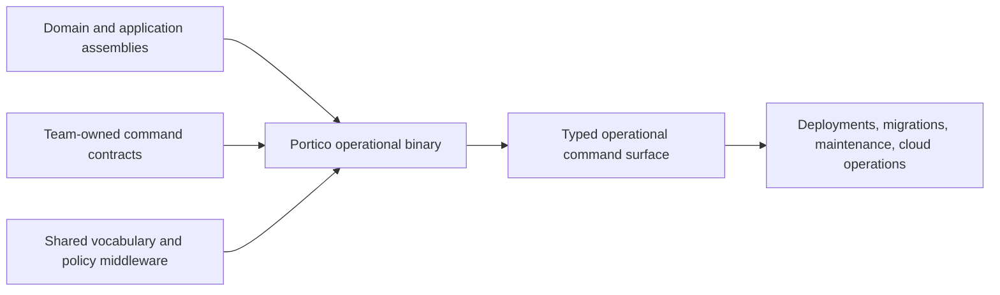

# Why Portico?

Portico is a contract-first operational command framework for .NET systems.

Its central proposition is simple:

> **Compile your operational CLI with the system it operates.**

A serious operational command rarely stops at parsing `args`. It resolves application services,
loads configuration, applies policy, calls cloud APIs, coordinates several steps, observes
cancellation and reports an exit code to automation. In a substantial .NET system, the types and
services for that work already exist. Portico turns selected parts of that compiled system into a
command surface rather than asking you to construct a second application architecture beside it.



## The unit of composition is a .NET contract

In Portico, a command starts as an ordinary interface or class method:

```csharp
public interface IDeploymentOperations
{
    [CliRoute("deploy {service}")]
    [CliCommandExample(
        "deploy billing --environment production --region eu-west --change CHG-142")]
    Task<int> DeployAsync(
        string service,
        [TargetEnvironment] DeploymentEnvironment environment,
        [CloudRegion] Region region,
        [ChangeTicket] ChangeTicket change,
        CancellationToken cancellation = default);
}
```

That declaration is several boundaries at once:

- a C# contract between the command implementation and its composer;
- the route, argument and option schema an operator receives;
- metadata used to generate help;
- a surface the compiler and Roslyn analyzers can inspect;
- a type another assembly can reference, implement, package and mount;
- an executable set of documented invocations.

"Contract-first" does not mean generating C# from a separate schema. The C# contract *is* the
schema, and it participates in the same compilation as its implementation and consumers.

## Compilation integrity across the larger system

An operational CLI often sits beside a large platform codebase. It may need the same deployment
planner, database migrator, domain types, authentication clients, retry policies and telemetry used
by production hosts. Linking those assemblies gives the command surface several kinds of integrity:

| Integrity | What it means |
|---|---|
| **Type** | Commands call typed application services instead of reconstructing operations through strings. |
| **Version** | The final binary contains exact versions of its contracts and implementation assemblies. |
| **Composition** | The assembled route table is validated after team-owned contracts are mounted together. |
| **Lifecycle** | DI scopes, configuration, logging, cancellation and disposal follow the host's rules. |
| **Policy** | Shared validation, cloud policy, auditing and safety controls are reused rather than copied into scripts. |

This coupling is deliberate. If a service interface or domain model changes incompatibly, the
operational binary should normally stop compiling. A loosely coupled script may survive the build
only to discover the incompatibility during a deployment.

## A domain-specific operational language

Portico's attributes are inheritable extension points. A platform team can derive
`CliOptionAttribute` or `CliArgumentAttribute`, choose canonical aliases and descriptions, restrict
accepted parameter types, supply conversion behavior and carry defaults such as environment-variable
fallback or sensitivity.

The resulting command contracts can speak the system's language:

```csharp
[TargetEnvironment] DeploymentEnvironment environment,
[CloudRegion] Region region,
[ChangeTicket] ChangeTicket change,
[ProductionApproval] ApprovalToken approval
```

These are still ordinary C# attributes and types, published in ordinary assemblies. The result is a
small operational DSL without a separate grammar, schema compiler or configuration format. See
[Create domain-specific options](../how-to/domain-specific-options.md).

This is domain-*oriented*, not a claim that infrastructure attributes belong inside the domain
model. They form the command boundary's vocabulary. Keep the domain types independent when they are
useful elsewhere, and keep CLI spelling and help text in the boundary assembly.

## Middleware packages controls with policy

`CliMiddleware` derives from `CliOptions`. The same object can declare application-wide options and
implement the behavior those options control:

- `--dry-run` can prohibit mutating operations;
- `--change-ticket` can establish audit context;
- `--approve-production` can enforce an approval rule;
- `--audit` can record the redacted invocation;
- lifecycle hooks can acquire and release resources around every command.

This makes middleware an operational policy module rather than only a parser hook. It can take
constructor dependencies, be resolved from DI, and travel in the same package as the vocabulary and
contracts it governs. See
[Build an operational policy middleware](../how-to/operational-policy-middleware.md).

## Discovery scales with the composed surface

An assembly-composed CLI can become large enough that memorizing every route is unrealistic. Portico
derives general and command-specific help from the same final contract model it dispatches. When an
operator mistypes a command path or option, bounded Levenshtein matching suggests nearby valid
routes or aliases instead of returning only "unknown command."

This is supporting ergonomics, not Portico's architectural wedge: other frameworks also provide
strong help and suggestions. Its value here is that discovery follows composition automatically. A
new mounted contract appears in help and fuzzy discovery without a separate registry, catalog, or
hand-maintained command index. On the unknown-command path Portico omits option values because it
cannot yet know which values are sensitive.

## Reflection-first, deliberately

Portico uses reflection for route discovery, binding, help and assembly composition. That is not a
temporary implementation on the way to a source generator. It is the runtime model.

Reflection lets Portico consume ordinary .NET metadata and services directly:

- no generated command graph beside the application graph;
- no source-generator restrictions on how contracts are packaged;
- runtime composition from referenced contract types;
- normal `TypeConverter`, attribute, interface and DI conventions;
- one implementation path rather than reflection and generated paths that must remain equivalent.

The costs are real: Portico is incompatible with trimming and NativeAOT, carries managed-runtime
startup cost and will not beat Go, Rust or an AOT-first .NET framework on binary size. Those are good
reasons to choose another tool for a globally distributed utility. They are weak reasons to give up
the full .NET application graph in a deployment or maintenance program whose work dominates startup.

[Why Portico is reflection-first](aot.md) records the decision and its revisit conditions.

## Legible to the compiler, humans and coding agents

Typed declarations matter because they create a deterministic edit loop. The C# compiler checks the
larger assembly graph; Portico's Roslyn analyzers check command-specific invariants; diagnostics name
the declaration and correction; code fixes perform the mechanical repairs; contract validation runs
the documented invocations through the final routing and binding pipeline.

That shape helps humans and coding agents for the same reason: incorrect code produces local,
actionable evidence instead of requiring familiarity with an implicit builder graph.

Be precise about the claim. Portico is currently stronger for **agents authoring command code** than
for **agents invoking commands**. Verified help, stable exit codes, non-blocking prompts and redaction
help invocation, but a machine-readable command manifest has not been built and structured handler
output remains the application's responsibility. See [The two agent contracts](agent-first-contract.md).

## What Portico does not authorize

Sharing assemblies is not permission to erase architecture:

- Portico is not an authentication or authorization system.
- A command should normally call an application/service layer designed for reuse, not arbitrary
  production internals or a database reached behind the owning service's back.
- Cross-service boundaries remain cross-service boundaries. Reusing a cloud client or contract does
  not make an in-process call equivalent to an authenticated remote operation.
- A large operational binary can accumulate excessive privileges and dependencies. Package and
  deploy it according to the blast radius of the commands it exposes.
- Compile-time version coupling improves integrity but increases release coordination. That is a
  trade, not a free property.

## Why this is not only a layer over another parser

A general parser can call the same application services, and many Portico capabilities could be
implemented separately. Portico exists because the decisions compose:

- the service contract, not a command-object graph, is the central abstraction;
- inherited attributes define the binding vocabulary;
- middleware combines global options with operational policy;
- assemblies are mounted as command capabilities;
- complete control of parsing diagnostics permits sensitive-value guarantees;
- the core remains dependency-free while DI and hosting stay opt-in.

Whether those defaults are valuable depends on the application. If you want a flexible parser
toolkit, a presentation framework, NativeAOT or a tiny standalone utility, use a framework optimized
for that job. [The alternatives, honestly](alternatives.md) names them.

## The proposition

Portico is not interesting because it can parse `--region eu-west`. It is interesting when
`Region`, the deployment planner, the authorization client, the audit policy and the command
contract all belong to the same compiled system.

> **Define your operational language in C#. Compile it with your system.**
